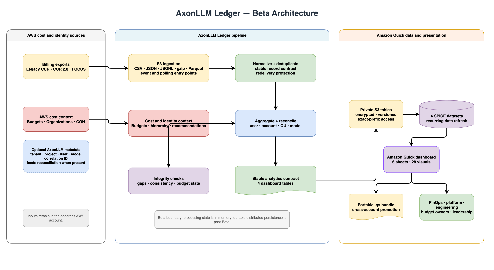

# AxonLLM Ledger

**Open-source cost intelligence for Amazon Bedrock and AWS AI workloads.**

AxonLLM Ledger turns AWS billing and organizational data into model-, user-,
account-, and organizational-unit-level cost views. It complements AxonLLM's
real-time routing and budget controls with billed-cost reconciliation,
optimization data, and dashboard-ready analytics.

The project is currently in Beta. It includes production S3 billing-export
ingestion, Legacy CUR/CUR 2.0/FOCUS normalization, cost reconciliation,
dashboard deployment and refresh, and portable Amazon Quick asset-bundle
export. Durable distributed persistence remains a post-Beta hardening item.

## What Ledger does

- Reads CSV, JSON, JSON Lines, gzip, and optional Parquet exports from S3.
- Normalizes Legacy CUR, CUR 2.0, and FOCUS billing records.
- Deduplicates redelivered or overlapping billing records.
- Attributes cost and usage by user, AWS account, organizational unit, and model.
- Tracks which users accessed which models.
- Compares billed cost with AWS Budgets data.
- Ingests AWS Organizations hierarchy and Cost Optimization Hub recommendations.
- Validates cross-dimension consistency and detects ingestion gaps.
- Produces a stable analytics package for Amazon Quick, Looker, or another BI target.
- Deploys, refreshes, exports, imports, and monitors Amazon Quick dashboards.

## AxonLLM family boundary

| Component | Responsibility |
|---|---|
| **AxonLLM** | Routes live model requests, records request-level usage, estimates cost, and enforces runtime budgets. |
| **AxonLLM Ledger** | Reconciles AWS billing data, allocates spend across the organization, and provides financial and optimization dashboards. |

AxonLLM answers, "What is this request expected to cost right now?" Ledger
answers, "What did AWS bill, who consumed it, how does it compare with budget,
and where can we optimize?"

## Data flow

```text
Legacy CUR / CUR 2.0 / FOCUS exports
                  |
                  v
        S3 ingestion adapter
                  |
                  v
       Normalize and deduplicate
                  |
                  v
     Aggregate and reconcile spend
                  |
                  v
        Ledger analytics package
            |              |
            v              v
   Amazon Quick tables   Optional BI target
            |
            v
   Versioned Quick asset bundle
```

## Architecture



[Open the full-size PNG](docs/architecture/axonllm-ledger.png) or
[edit the Draw.io source](docs/architecture/axonllm-ledger.drawio).

## Install for development

Python 3.11 or later is required.

```bash
python -m venv .venv
source .venv/bin/activate
python -m pip install -e ".[dev,quick]"
python -m pytest -q
```

Run the checked-in sample pipeline:

```bash
PYTHONPATH=src python examples/run_sample_pipeline.py
```

The sample writes generated Ledger and Amazon Quick table payloads under
`build/`.

## Core API

```python
from axonllm_ledger.aggregation import AggregationEngine, TimeRange
from axonllm_ledger.export import package_export_data
from axonllm_ledger.quick_dataset import build_quick_dataset_tables

engine = AggregationEngine(records=usage_records)
package = package_export_data(
    engine=engine,
    time_range=TimeRange(start=period_start, end=period_end),
    budgets=budgets,
    recommendations=recommendations,
    user_ids=user_ids,
)

quick_tables = build_quick_dataset_tables(package)
```

The Quick contract contains four tables:

- `cost_aggregations`
- `model_access`
- `budgets`
- `optimization_recommendations`

Financial values are represented as exact decimal text in the JSON contract so
they can be cast to fixed-precision decimal columns by Athena without
floating-point loss.

## Amazon Quick dashboard deployment

Install the optional AWS SDK dependency:

```bash
python -m pip install -e ".[quick]"
```

Generate the dashboard-ready sample tables:

```bash
PYTHONPATH=src python examples/run_sample_pipeline.py
```

Then deploy the six-sheet dashboard in the Quick account's identity region:

```bash
axonllm-ledger-dashboard --region us-east-1
```

The command is idempotent. It creates or updates:

- one encrypted, versioned, private S3 bucket for the dashboard tables;
- an exact-prefix bucket policy for the account's existing Quick service role;
- four S3 data sources and four SPICE datasets;
- the AxonLLM Ledger dashboard with 6 sheets and 28 visuals.

The dashboard definition is stored in
`axonllm_ledger.quick_dashboard_definition`, so visuals and layouts are reviewed
and versioned with the code. The deployer uses the standard AWS credential
chain and does not accept or persist plaintext credentials.

Explore the
[interactive sample dashboard](https://hk-775.github.io/axonllm-ledger/)
without an AWS account. The GitHub Pages preview renders all six sheets from
the repository's synthetic sample data; it does not connect to AWS or expose
credentials.

Use `--dataset-json` to deploy a production Quick table export instead of the
sample file. See [the Quick dashboard guide](dashboards/quick/README.md) for
the resource model, sheet inventory, and optional asset-bundle export workflow.

## Supported billing formats

The S3 adapter reads CSV, JSON, JSON Lines, gzip-compressed files, and optional
Parquet files. The normalization layer maps Legacy CUR, CUR 2.0, and FOCUS
fields into Ledger's stable ingestion contract before parsing and
deduplication. Because billing schemas can be customized, adopters should
validate their export columns with representative data before production use.

## Current implementation limits

- The core pipeline uses in-memory collections; production persistence is not implemented.
- The S3 adapter reads one export object into memory at a time; very large
  exports should be partitioned before ingestion.
- User-level attribution requires identity fields in billing data or
  complementary AxonLLM metadata; Ledger cannot infer identity that the source
  does not provide.
- Dashboard sharing, embedding, row-level security, and promotion approval
  remain adopter-controlled.
- Looker remains possible through the generic `DeliveryTarget` protocol, but
  Amazon Quick is the primary dashboard target.

## Development

```bash
python -m pytest -q
python -m build
```

See [CONTRIBUTING.md](CONTRIBUTING.md) and [SECURITY.md](SECURITY.md) before
submitting changes or vulnerability reports.

## License

MIT-0. See [LICENSE](LICENSE).
